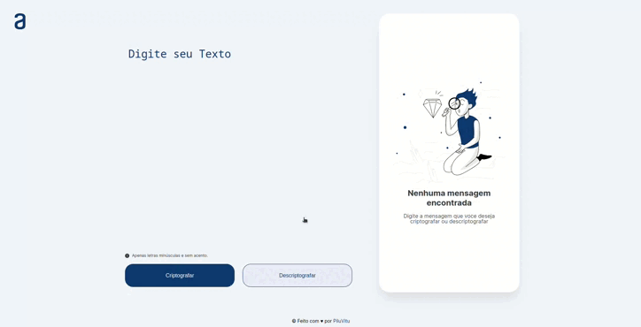

<strong><h1 align="center">Barbearia Alura</h1></strong>

  

## 🤔 **Sobre**

Projeto final da 1 etapa do OracleOne(Programa de formação da Oracle em parceria com a Alura)

## 🚀 **Tecnologias**

Esse projeto foi desenvolvido com as seguintes tecnologias:

- HTML
- CSS
- JavaScript
- [Toastify](https://apvarun.github.io/toastify-js/#)

## 🛠️ **Execução**

O usuário pode inserir a frase/palavra que desejar, e clicar no botão de criptografar, para criptografar a mensagem e assim esconder o que está escrito, caso você tenha uma mensagem
criptografada, poderá descriptografar a mensagem.
 
A exibição de erros da aplicação é feita pelo Toastify e o padrão da criptografia é:
  |Letra| Crypt|
  |---|---|
  |e|enter|
  |i|imes|
  |a|ai|
  |o|ober|
  |u|ufat|

O JavaScript foi feito todo modularizado para facilitar a leitura e organização do código. Ajudando a reforçar conceitos de classes, exports, manipulação de array e string, assim como pratica com DOM elements. 

---

Feito com ♥ by [PiluVitu](https://piluvitu.dev)